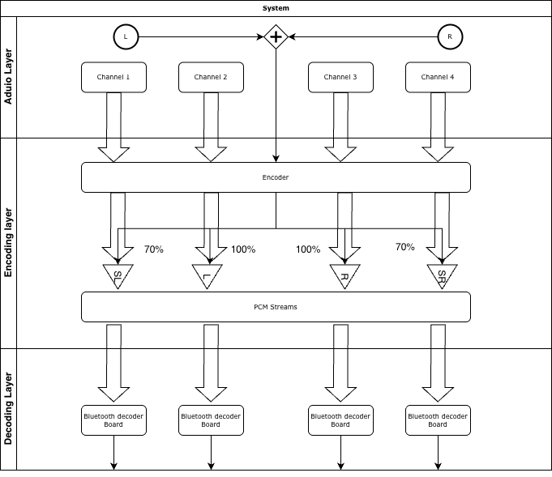

# DREAMPILLOW
> Electronic musician developing a neck-worn, open-ear wearable that uses ultrasonic sensing for continuous position/head-motion tracking and real-time HRTF measurement to deliver precise, immersive audio for XR and everyday use.

 [](https://github.com) 

<video width="100%" controls>
  <source src="Media/Audio Pillow.mp4" type="video/mp4">
  Your browser does not support the video tag.
</video>

## Table of Contents

- [Background](#background)
- [Video](#video)
- [Features](#features)
- [Install](#install)
- [Quick Start](#quick-start)
- [Architecture](#architecture)
- [Version](#version)
- [TODO](#todo)
- [Contributing](#contributing)
- [Acknowledgements](#acknowledgements)
- [License](#license)

## Background

As an electronic musician working with spatial audio and immersive sound design, I am developing DreamPillow—a neck-worn, open-ear wearable system that transforms how we experience audio. The system uses ultrasonic sensing for continuous position and head-motion tracking, combined with real-time HRTF (Head-Related Transfer Function) measurement to deliver precise, immersive audio. This technology enables both extended reality (XR) applications and enhanced everyday audio experiences, where sound becomes spatially aware and dynamically adapts to the user's position and movement.

DreamPillow processes multi-channel audio for transmission across multiple Bluetooth decoder boards, creating an immersive 4-channel audio experience optimized for wearable applications.

## Video

<video width="100%" controls>
  <source src="Media/Audio Pillow.mp4" type="video/mp4">
  Your browser does not support the video tag.
</video>

**Watch:** [Audio Pillow Demo](Media/Audio%20Pillow.mp4)

## Features

- **Multi-format Audio Processing**: Decodes MP3 files and converts to PCM format
- **4-Channel Audio Encoding**: Automatically converts stereo to 4-channel (L, R, SurroundL, SurroundR)
- **Flexible Channel Mapping**: Handles mono, stereo, and multi-channel input sources
- **Bluetooth-Ready Output**: Generates PCM-encoded streams optimized for Bluetooth 5.0 transmission
- **Sample Rate Conversion**: Automatic resampling to target sample rates (default: 44.1kHz)
- **Separate Channel Encoding**: Outputs individual channel streams for distributed playback across multiple decoder boards



## Install

```
# Clone the repo
git clone <repository-url>

cd DreamPillow

# Create and activate a virtual environment (Python 3.7+ recommended)

python3 -m venv .venv
source .venv/bin/activate        
# On Windows use: .venv\Scripts\activate

# Install dependencies
pip install --upgrade pip
pip install -r requirements.txt

# Install FFmpeg (required for MP3 decoding)
# macOS: brew install ffmpeg
# Linux: sudo apt-get install ffmpeg
# Windows: Download from https://ffmpeg.org/
```

## Quick Start

### Command Line Usage

```bash
python encoder.py your_audio.mp3
```

This will:
1. Decode the MP3 file
2. Extract/create 4 channels (L, R, SurroundL, SurroundR)
3. Encode each channel as separate PCM streams
4. Output 4 byte streams ready for Bluetooth transmission

### Python API Usage

```python
from encoder import process_mp3

# Process MP3 file
encoded_channels = process_mp3("your_audio.mp3")

# Access individual channels
channel_0 = encoded_channels[0]  # Left
channel_1 = encoded_channels[1]  # Right
channel_2 = encoded_channels[2]  # Surround Left
channel_3 = encoded_channels[3]  # Surround Right

# Send each channel to respective Bluetooth board
```

## Architecture

### Audio Processing Pipeline

```
MP3 File → Decode → Resample → Extract 4 Channels → Encode PCM → Bluetooth Streams
                                                          ↓
                                    [Channel 0] [Channel 1] [Channel 2] [Channel 3]
                                          ↓          ↓          ↓          ↓
                                    Board 1    Board 2    Board 3    Board 4
```

### Channel Mapping

**Stereo Input → 4 Channels:**
- Channel 0: Left (100%)
- Channel 1: Right (100%)
- Channel 2: Surround Left (70% of Left)
- Channel 3: Surround Right (70% of Right)

**Other Input Formats:**
- Mono: Duplicated to all 4 channels
- 4+ channels: Uses first 4 channels
- Other: Cycles available channels

### Technical Specifications

- **Sample Rate**: 44.1 kHz (configurable)
- **Bit Depth**: 16-bit PCM (configurable: 16 or 24-bit)
- **Output Format**: Raw PCM bytes (little-endian)
- **Channels**: 4 separate mono streams
- **Bluetooth**: Compatible with Bluetooth 5.0 MP3 decoder boards

## Version

| Version | Status | Description |
| ----------- | ----------- | ----------- |
| [V 1.0.0](encoder.py) | Current | Initial release with MP3 to 4-channel PCM encoding |

## TODO

- [X] MP3 decoder implementation
- [X] 4-channel audio extraction
- [X] Stereo to surround channel mapping
- [X] PCM encoding for Bluetooth transmission
- [ ] Interleaved encoding mode for single bus transmission
- [ ] Real-time streaming support
- [ ] HRTF processing integration
- [ ] Ultrasonic tracking integration
- [ ] XR audio spatialization

## Contributing

```
Core System

Concept & Lead Design: Li (Charlie) Shi

System Design & Technical Direction: Li (Charlie) Shi

Multichannel & Spatial Audio Mapping: Li (Charlie) Shi

Product Prototyping & Integration: Li (Charlie) Shi

Hardware

MRC Circuits and Systems: LUCA MARCHETTI

Phased Array Ultrasound Testing Platform PCB: LUCA MARCHETTI

Video

Camera: Han

Video Editing: Han

Special Thanks

Akito Van Troyer
```

## Acknowledgements

DreamPillow uses:
- [NumPy](https://numpy.org/) for numerical audio processing
- [SciPy](https://scipy.org/) for signal processing and resampling
- [pydub](https://github.com/jiaaro/pydub) for MP3 audio file handling
- [FFmpeg](https://ffmpeg.org/) for audio codec support

### Circuit References

- [Ultrasonic Sound Gun (Parametric Speaker)](https://www.instructables.com/Ultrasonic-Sound-Gun-Parametric-Speaker/) - Reference for ultrasonic transducer circuit design and modulation techniques

## License
[MIT](LICENSE) © lishi

